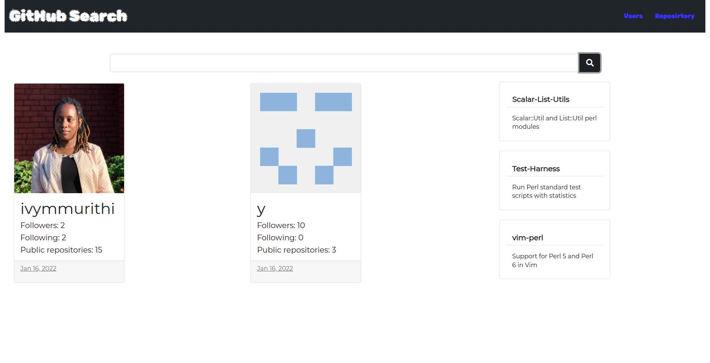

# Project Name
GitHub Search

## Descriptiom
This project enables one to get github users by searching their names in the search bar provided. The results returned are their username, name,description and number of public repositories,profile pictures,followers and following.

## Setup Instructions
Enter the name of the person you would like to search inside the search bar then click on the search button to bring results,

## Author and Author information
Ivy Murithi, a student studying software development.

## Technologies Used
1. Angular
2. GitHub Api
3. TypeScript
4. Bootstrap
5. Google Fonts
6. Font Awesome
7. HTML
8. CSS

## Future Improvements
Better UI for the repositories list

## Contacts
[Email](mailto:ivymurithi@gmail.com)
